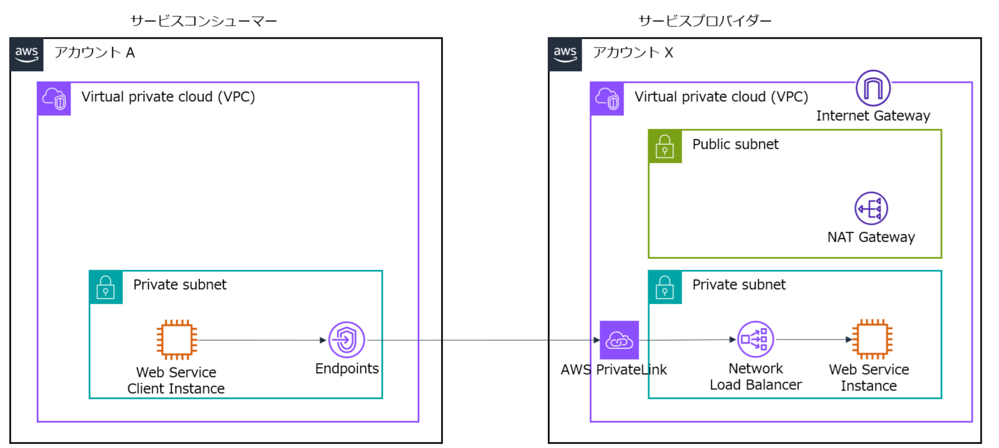

# PrivateLink のプロバイダーとコンシューマーのデモ環境の構築手順

* アカウント A の EC2 インスタンスからアカウント X の **VPC エンドポイントサービス(PrivateLink)** にアクセスする

* 前提
    - AWS マネジメントコンソールを使用する
    - 東京リージョンまたは大阪リージョンを使用する

* 全体構成図

---

## VPC エンドポイントサービス(PrivateLink) のプロバイダー環境の構築

1. アカウント X で AWS CloudFormation を使用し、このリポジトリにある **PrivateLink_Provider.yaml** テンプレートからスタック作成を開始する。

1. スタック名は任意の名前を入力する。

1. スタック作成時のパラメータで、**AllowAccountID** にアカウント A (コンシューマー側)の AWS アカウント ID を入力する。

1. 他のパラメータはデフォルトのままでスタック作成を完了させる。

1. スタック作成が完了したら、**出力** タブで **ServiceName** の値をメモしておく。

---

## VPC エンドポイントサービス(PrivateLink) のコンシューマー環境の構築

1. アカウント A で VPC のコンソールを表示する。

1. 左側のナビゲーションメニューから **PrivateLink と Lattice** - **エンドポイント**　を選択する。

1. **エンドポイントを作成** を選択する。

1. **名前タグ**　で任意の名前を入力する。

1. **タイプ** で **NLB と GWLB を使用するエンドポイントサービス**　を選択する。

1. **サービス名** に、メモしておいた **ServieName** を入力し、**サービスの検証** を選択する。
    - 「サービス名が検証されました。」というメッセージが表示されることを確認する。

1. **ネットワーク設定** で VPC、サブネット、セキュリティグループを選択する。
    - Public サブネット、Private サブネットのどちらでもよい
    - Private サブネットを指定する場合は、後の手順で EC2 インスタンス を作成するときに Session Manager などでアクセス可能な状態にしておく。

1. **エンドポイントを作成**　を選択する。

1. ページ下部で **DNS 名** のうちの 1つをメモしておく。

---

## VPC エンドポイントサービス(PrivateLink) のプロバイダーで接続リクエストの承諾

1. アカウント X で VPC のコンソールを表示する。

1. 左側のナビゲーションメニューから **PrivateLink と Lattice** - **エンドポイントサービス**　を選択する。

1. **my-service** の左側のチェックボックスをチェックし、ページ下部の **エンドポイント接続** を選択する。

1. **状態** が **Pending acceptance** の接続を選択して、**アクション** から **エンドポイント接続リクエストの承諾** を選択する。

1. ダイアログで必要な文字を入力して **承諾** を選択する。

1. **状態** が **Available** になるまで待つ。

---

## VPC エンドポイントサービス(PrivateLink) のコンシューマー環境の EC2 インスタンスからサービスへ接続

1. アカウント A で EC2 インスタンスを作成する。
    - VPC とサブネットは VPC エンドポイント作成時に指定したものを指定する。
    - SSH または Session Manager でアクセスする。

1. curl コマンドでアクセスを確認する。
    - `curl  <メモしておいた DNS 名>`
    - <H1> タグで囲まれた **Welcome to my Service** という文字が表示されることを確認

---

## 環境のクリア

1. アカウント A で作成した EC2 インスタンスを削除する。
1. アカウント A で作成した VPC エンドポイントを削除する。
1. アカウント X で作成した AWS CloudFormation スタックを削除する。

